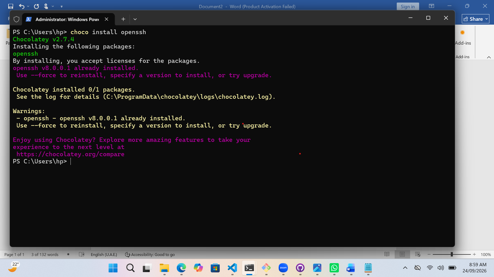
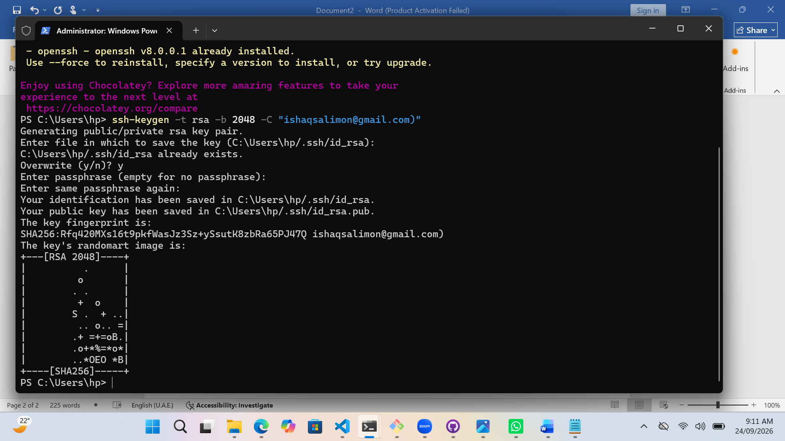
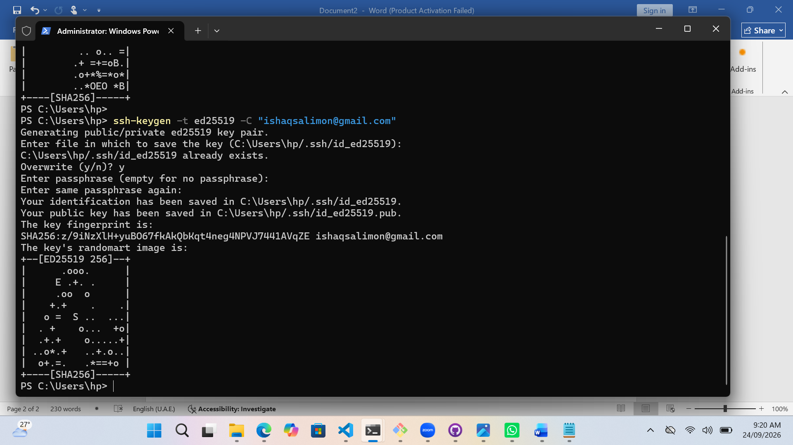
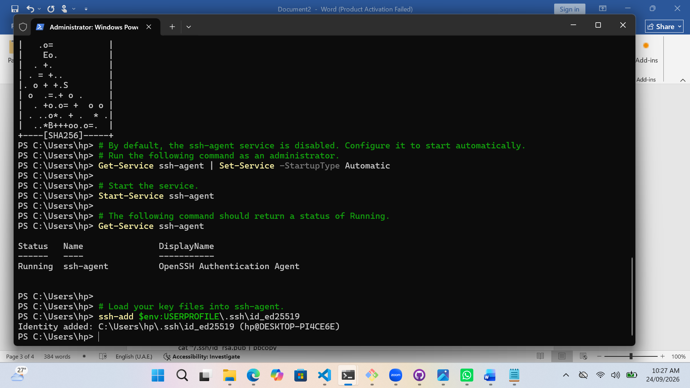
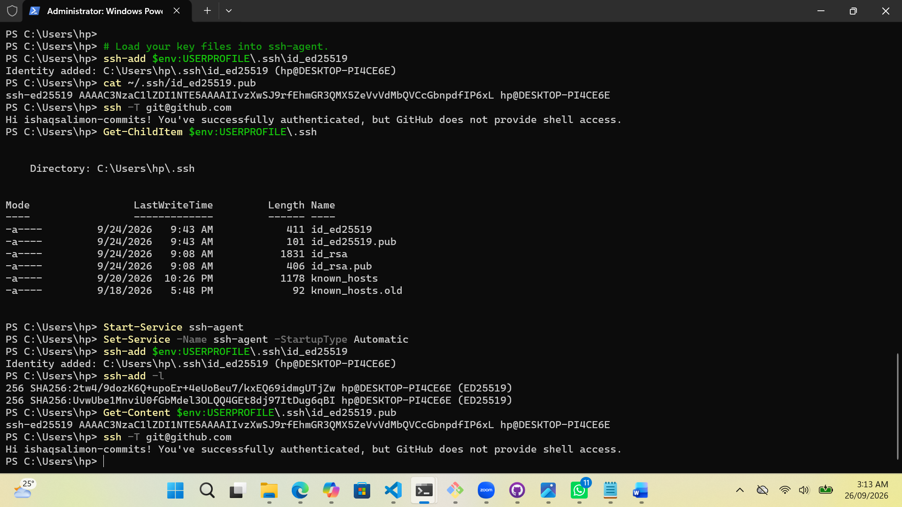
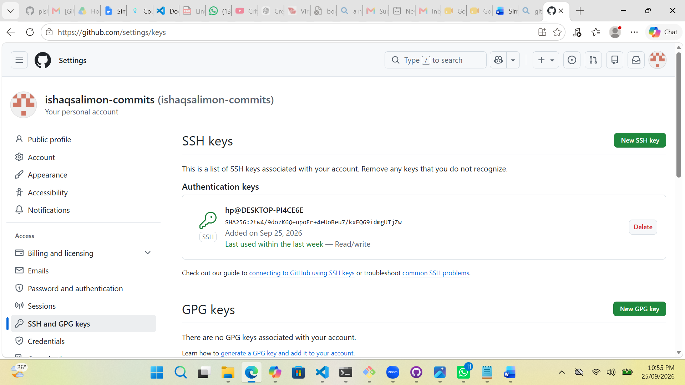
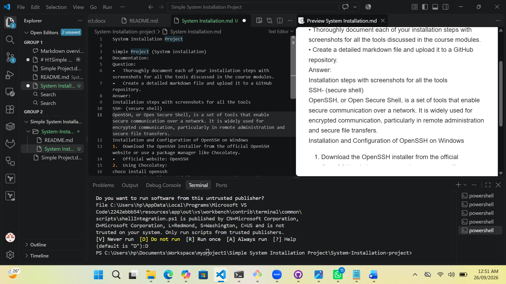
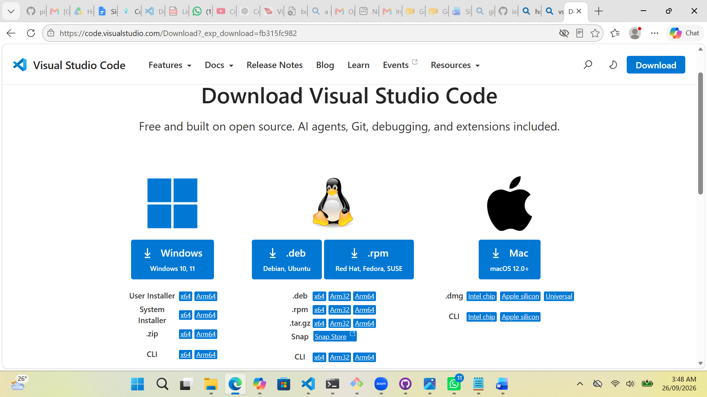
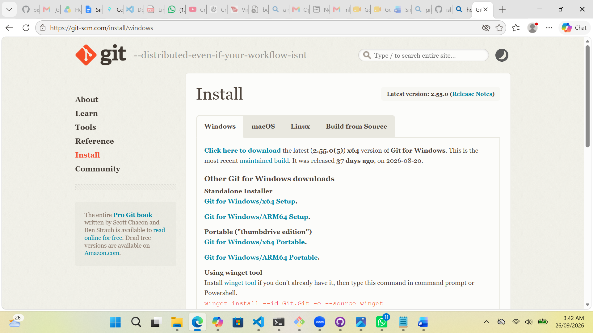

### Simple System Installation Projct 

#### Question
###### Thoroughly document each of your installation steps with screenshorts for all the tools discussed in the course modules.
###### Create a detailed markdown file and upload it to a GitHub repository.
#### Answer
##### Installation and Configuration of OpenSSH on Windows:
Download the OpenSSH installer from the official OpenSSH website or use a package manager like Chocolatey.
Official website: OpenSSH
Using Chocolatey:
choco install openssh
Run the installer and follow the on-screen instructions.
During installation, ensure that the option to add OpenSSH to the system PATH is selected.

*open ssh image*

Generating SSH Key Pairs for Secure Authentication
Open a terminal or command prompt on your system.
Run the following command to generate an SSH key pair:
ssh-keygen -t rsa -b 2048 -C "your_email@example.com"
Replace "your_email@example.com" with your actual email address.

You will be prompted to choose the location to save the key pair. Press Enter to accept the default location.
Set a passphrase for an additional layer of security, or press Enter to skip this step.
Two files, id_rsa (private key) and id_rsa.pub (public key), will be generated.

*ssh key images*

ssh-agent is a program that holds private keys used for public key authentication. It acts as an authentication agent, managing the keys and eliminating the need to re-enter passphrases every time a user connects to a remote server.
Run:
###### By default, the ssh-agent service is disabled. Configure it to start automatically.
###### Run the following command as an administrator.
Get-Service ssh-agent | Set-Service -StartupType Automatic

###### Start the service.
Start-Service ssh-agent

###### The following command should return a status of Running.
Get-Service ssh-agent

###### Load your key files into ssh-agent.
ssh-add $env:USERPROFILE\.ssh\id_ed25519

*ssh agent image*

Configuring SSH for Seamless Integration with Version Control Systems and Remote Servers
Copy the public key to the clipboard:
cat ~/.ssh/id_rsa.pub | pbcopy

*Configuration ssh version control Image*

Add the SSH key to your version control system (e.g., GitHub, GitLab):
For GitHub, navigate to Settings > SSH and GPG keys > New SSH key, and paste the key.
Test the SSH connection:
ssh -T git@github.com
Respond to the prompt by typing "yes."

*ssh key add to github image*

 ##### Markdown is a lightweight markup language with plain text formatting syntax. It is widely used for creating rich documents and is especially popular in the development and documentation communities due to its simplicity and readability.

Key Elements in Markdown Format:
Headings: Single # is used to begin a wword/sentence to be used as heading. e.g # Heading 1, while the double ## is used as a sub-heading. e.g ## Heading 2, ...
Emphasis: To italise a word ** is used by iserting the word at the middle of asterisk e.g _ italic_, To make bold of a word/sentence the double asterisk is used e.g ** bold**
Lists: There are two types of list i.e Unordered List and Ordered List. hyphen(-) is used for unordered while numericals (1,2,..) for ordered list.
Links: Adding a link for refrence or additional details you use the format Link Text
Images: 
Code: To add a line of code `inline code`, code block
Horizontal Rule: ---

*markdown image*

#### Visual Studio Code (VScode)
Step 1: Choose Your Operating System
Visual Studio Code (VS Code) is a versatile code editor compatible with Windows, macOS, and Linux. Begin by selecting the appropriate installation package for your operating system.

Windows:
Step 2: Navigate to the official VS Code download page at https://code.visualstudio.com/.
Click on the "Download for Windows" button.
Once the installer is downloaded, double-click to launch it.
Follow the installation wizard, accepting the default settings unless you have specific preferences.

Basic Configuration and Settings
After installing Visual Studio Code, optimize your environment for efficient development.

Launch VS Code.
Explore the user interface and settings by clicking on the gear icon in the bottom left corner.
Customize settings by navigating to "File" > "Preferences" > "Settings" (or using Ctrl + ,).
Adjust preferences such as font size, theme, and keybindings according to your preferences.
Step 3: Extensions and Plugins for Enhanced Productivity
Extensions and plugins enhance VS Code's functionality. Install them based on your development needs.

Navigate to the Extensions view by clicking on the Extensions icon in the Activity Bar on the side of the window or use Ctrl + Shift + X.
Search for extensions in the Extensions view search bar.
Install desired extensions by clicking the install button.
Step 4: Version Control Integration with Git in Visual Studio Code

*Vscode Installation image*

##### Ensure Git is installed on your system. If not, download and install it from https://git-scm.com/.

*git Installation image*

